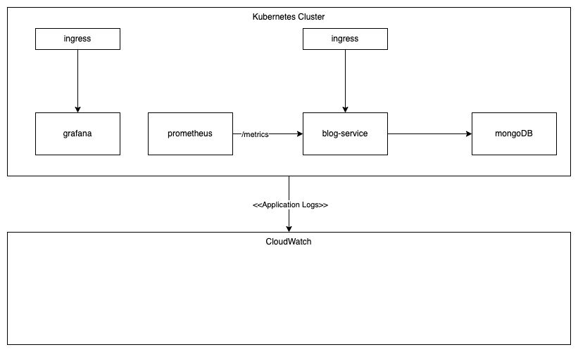

# assignment-devops

This is an assignment task for DevOps candidate
The objective of this taks is to ensure that candidate has a good understanding of DevOps workflow, and hand-on experience.

## Tasks
1. Provision EKS (or AKS) and other required component/services using infrastructure as a code (IaC), preferably using `terraform`. For code should be stored in the repository [assignment-iac](https://github.com/Zeabix/assignment-iac). in subfolder `terraform`
2. Create CICD for repository [blog-service](https://github.com/Zeabix/blog-service), candidate can choose using between `cicleci` or `github action`. The minimum requirements for CICD pipeline is to build the docker image and pushed to container registry and also responsible to deployment to EKS. However, any additional step will be considered a plus, e.g. test, code scan, etc.
3. The files that relate to EKS deployment must be stored in repository [assignment-iac](https://github.com/Zeabix/assignment-iac), in subfolder `cd`, prefer using `helm` chart
4. Candidate must read the `README.md` in repository [blog-service](https://github.com/Zeabix/blog-service) since it contains the important information about the service and how it's running
5. Provision Prometheus/Grafana inside the EKS
6. The `blog-service` also have the metrics endpoint, ensure that the prometheus can get those application metrics
7. The application log must be delivered to `AWS Cloudwatch`
8. The application required the mongoDB as its datasource, ensure that the mongoDB is also deployed inside the kubernetes

The image below shows the overall requirements for this task, as mention in the items above, the solution will need the mongodb running as a service in Kubernetes cluster, preferably in its own namespace e.g. db.

This following diagram shows more details for solution, the application provided `blog-service` has `/metrics` endpoint which is expected to be scraped by prometheus. Also the `blog-service` will need the mongodb as persistent layer.

Please also create ingress for of `blog-service` and `grafana` (the self-signed certificate would be ok)

Also the log messages should be transported and stored in `CloudWatch` 

NOTE: All infrastructure resouces that provisioned during this assignment should be done as an IaC (infrastructure as a code) and store in the repository mentioned above
